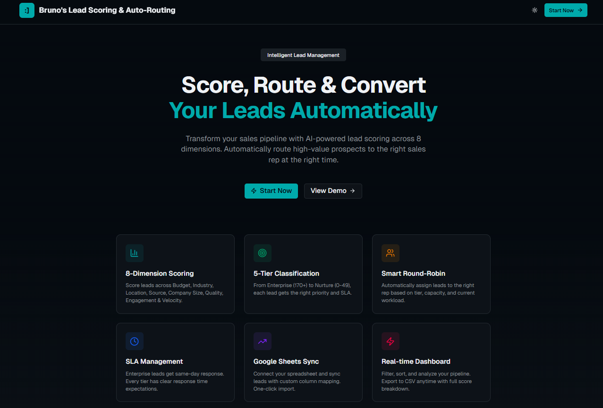

# Lead Scorer & Auto Router

A lightweight lead management app to import leads, score them, and automatically route them to the right team.


---

## ✨ Features

- **Lead intake**
  - Add/edit leads in the dashboard
  - Bulk import support (UI-driven)
  - Optional **Google Sheets sync** (if enabled/configured)
- **Scoring**
  - Deterministic lead scoring logic
  - Score visualization (badges + stats cards)
- **Auto-routing**
  - Route leads to teams/owners using routing rules
- **Dashboard**
  - Filters, tables, and quick stats
- **API routes**
  - `/api/leads` for lead operations
  - `/api/team` for team/team-member operations

---

## 🖥️ Prerequisites

- **Node.js (LTS recommended)**
- Package manager:
  - **npm** (works out of the box)
  - **pnpm** (optional; this repo includes `pnpm-lock.yaml`)

Verify installs:

```bash
node -v
npm -v
# optional
pnpm -v
```

---

## 📦 Install

From this project folder:

### Option A — npm

```bash
npm install
```

### Option B — pnpm

```bash
pnpm install
```

---

## ▶️ Run locally

### npm

```bash
npm run dev
```

### pnpm

```bash
pnpm dev
```

Then open:

```text
http://localhost:3000
```

To stop the server, press `Ctrl + C` in the terminal.

---

## ⚙️ Environment variables (optional)

If you enable integrations like Google Sheets sync, create a `.env.local` file in the project root.

To see what variables you need for your setup:
- Search for `process.env` in the repo
- Check `app/api/*` and the Google Sheets sync UI in `components/google-sheets-sync.tsx`

---

## 🧩 Project structure (high level)

- `app/`
  - `page.tsx` – main dashboard page
  - `layout.tsx` – global layout
  - `api/` – API routes (`leads`, `team`)
- `components/`
  - Dashboard UI: tables, filters, dialogs, stats
  - `google-sheets-sync.tsx` – Google Sheets import/sync UI
  - `ui/` – shared UI primitives
- `lib/`
  - `scoring.ts` – scoring logic
  - `routing.ts` – routing logic
  - `store.ts`, `types.ts`, `utils.ts` – shared utilities/types

---

## 🔧 Common customization

- Update scoring rules: `lib/scoring.ts`
- Update routing rules: `lib/routing.ts`
- Update dashboard behavior/UI:
  - `app/page.tsx`
  - `components/leads-table.tsx`
  - `components/dashboard-filters.tsx`

---

## 📌 Notes

- If something doesn’t start:
  - Make sure Node.js is installed (`node -v`)
  - Re-run dependency install (`npm install` or `pnpm install`)
  - Check terminal output + browser console for errors

## 📬 Contact
If you’re using this project, experimenting with it, or have ideas to improve it, feel free to reach out:
- LinkedIn: [Bruno M. Guerreiro, Ph.D.](https://www.linkedin.com/in/bmguerreiro/)


